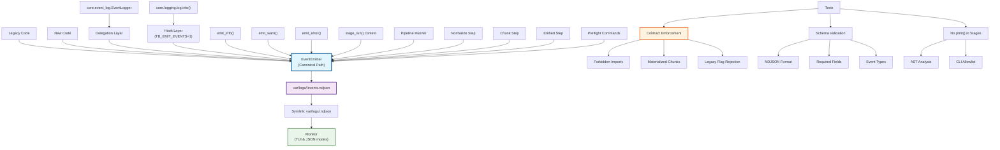

# Trailblazer Observability System Architecture

## Overview

The Trailblazer observability system provides comprehensive, standardized event emission across all pipeline components with **EventEmitter as the canonical logging path**. This system eliminates silent failures, ensures consistent event formats, and provides robust monitoring capabilities.

## System Architecture



## Core Components

### 1. EventEmitter (Canonical Path)

**Location**: `src/trailblazer/obs/events.py`

The central hub for all observability events with typed schemas and standardized field names.

**Key Features**:

- **Standardized Schema**: All events include `ts`, `run_id`, `phase`, `component`, `pid`, `worker_id`, `level`, `action`
- **File Management**: Creates `var/logs/<RID>/events.ndjson` with automatic rotation
- **Symlink System**: Creates `var/logs/<RID>.ndjson` → `<RID>/events.ndjson` for monitor compatibility
- **Context Managers**: Automatic file handling and cleanup

### 2. Thin Adapters

**Location**: `src/trailblazer/obs/events.py`

Simple functions for easy adoption across the codebase.

```python
# Basic event emission
emit_info("stage", run_id, "operation", message="Process started", **fields)
emit_warn("stage", run_id, "operation", message="Warning occurred", **fields)  
emit_error("stage", run_id, "operation", message="Error occurred", **fields)

# Context manager with START/END + duration
with stage_run("stage", run_id, "operation", **start_fields) as ctx:
    # do work
    ctx.update(result="success")  # Added to END event
```

### 3. Legacy Compatibility

**Location**: `src/trailblazer/core/event_log.py`, `src/trailblazer/core/logging.py`

Seamless delegation to EventEmitter without breaking existing code.

**EventLogger Delegation**:

- `EventLogger._write_event()` → EventEmitter
- Field mapping for backward compatibility
- Deprecation warnings guide migration

**Logging Hooks**:

- `TB_EMIT_EVENTS=1` enables event emission from `log.info()` calls
- Best-effort context extraction (run_id, stage, op)
- Silent fallback prevents breaking existing logging

## Pipeline Integration

### 1. Pipeline Runner

**Location**: `src/trailblazer/pipeline/runner.py`

Top-level orchestration with comprehensive event emission.

**Events Emitted**:

- **Pipeline START**: phases, dry_run status
- **Pipeline END**: phases_completed, total_phases, duration
- **Backlog START**: phase, total_available runs
- **Backlog END**: processed_runs, total_available

### 2. Normalize Step

**Location**: `src/trailblazer/pipeline/steps/normalize/html_to_md.py`

Document normalization with traceability preservation.

**Events Emitted**:

- **START**: input_file information
- **END**: docs, empty_bodies, attachments, avg_chars counts
- **WARNINGS**: backlog update failures

**Traceability Preserved**:

- `title`, `url`, `source_system`, `labels`, `space`, `media_refs`
- All existing normalization logic maintained

### 3. Chunk Step

**Location**: `src/trailblazer/pipeline/steps/chunk/engine.py`, `src/trailblazer/cli/main.py`

Token-bounded chunking with comprehensive event tracking.

**Contract Changes**:

- **Removed**: Silent `emit_event = pass` fallback
- **Added**: `ImportError` if `obs.events` unavailable
- **Added**: Optional `emit` parameter to `chunk_document()`

**Events Emitted**:

- **chunk.begin**: doc_id, title, source_system
- **chunk.doc**: chunk_id, token_count, chunk_type, split_strategy (per chunk)
- **chunk.end**: doc_id, total_chunks, coverage_pct
- **chunk.force_truncate**: When chunks exceed hard token cap
- **chunk.coverage_warning**: When coverage < 99.5%

**CLI Integration**:

```python
# EventEmitter created in CLI and passed to engine
emitter = EventEmitter(run_id, "chunk", "chunker")
with emitter:
    _execute_phase("chunk", outdir, emit=emit_wrapper)
```

### 4. Embed Step

**Location**: `src/trailblazer/pipeline/steps/embed/loader.py`, `src/trailblazer/cli/main.py`

Embedding generation with fail-fast validation.

**Contract Enforcement**:

- **Forbidden Modules**: Prevents chunk engine imports
- **Materialized Chunks**: Validates `chunks.ndjson` exists and non-empty
- **Legacy Flag Rejection**: Blocks `--chunk-size`, `--chunk-overlap`, etc.

**Events Emitted**:

- **START**: provider, model, chunks_file
- **SUCCESS**: docs_embedded, chunks_embedded, total_tokens, status="OK"
- **FAILURE**: error count, status="FAIL"

### 5. Preflight Commands

**Location**: `src/trailblazer/cli/main.py`

Readiness validation with detailed status reporting.

**Events Emitted**:

- **Single Preflight**: START, READY/BLOCKED with reason codes
- **Plan Preflight**: Per-RID READY/BLOCKED events, completion summary

**Reason Codes**:

- `RUN_NOT_FOUND`, `MISSING_ENRICHED`, `EMPTY_ENRICHED`
- `MISSING_CHUNKS`, `QUALITY_GATE`, `TOKENIZER_MISSING`
- `CONFIG_INVALID`, `PREFLIGHT_FILE_MISSING`, `PREFLIGHT_PARSE_ERROR`

## Event Schema

### Standard Fields (All Events)

```json
{
  "ts": "2025-08-19T17:30:00.000Z",
  "run_id": "unique-run-identifier", 
  "phase": "ingest|normalize|chunk|embed|preflight|runner",
  "component": "confluence|dita|chunker|upsert|pipeline",
  "pid": 12345,
  "worker_id": "component-pid",
  "level": "info|warning|error|debug",
  "action": "start|tick|complete|warning|error|heartbeat"
}
```

### Context Fields (Phase-Specific)

```json
{
  "space_key": "DEV",
  "space_id": "123456",
  "page_id": "789012", 
  "chunk_id": "run:0001",
  "provider": "openai",
  "model": "text-embedding-3-small",
  "embedding_dims": 1536,
  "duration_ms": 1500,
  "metadata": {
    "message": "Human-readable message",
    "custom_field": "additional_data"
  }
}
```

## File Structure

### Event Storage

```
var/logs/
├── <run_id>/
│   ├── events.ndjson          # Primary event log
│   └── stderr.log             # Error output
├── <run_id>.ndjson           # Symlink → <run_id>/events.ndjson
├── latest.ndjson             # Symlink → latest run events
└── latest.stderr.log         # Symlink → latest run errors
```

### Monitor Integration

- **Monitor reads**: `var/logs/<run_id>.ndjson` (symlink)
- **EventEmitter writes**: `var/logs/<run_id>/events.ndjson` (actual file)
- **Perfect sync**: Via symlink system

## Testing Framework

### Test Coverage (36 Tests Total)

- **12 Core Observability Tests**: EventEmitter functionality, schema validation
- **2 Normalize Tests**: Event emission, traceability preservation
- **4 Chunk Tests**: Event emission, no silent no-ops
- **5 Preflight Tests**: READY/BLOCKED events, reason codes
- **7 Embed Tests**: Contract enforcement, event emission
- **6 CLI Tests**: Dimension flag consistency

### Contract Enforcement Tests

```python
# No print() in stage modules (AST analysis)
tests/obs/test_no_print_in_stages.py

# Forbidden chunk imports in embed
tests/embed/test_embed_contract.py

# Legacy flag rejection
tests/cli/test_dimension_flag.py

# Event schema compliance
tests/obs/test_emitter_contract.py
```

## Usage Examples

### Basic Event Emission

```python
from trailblazer.obs.events import emit_info, emit_warn, emit_error

# Simple events
emit_info("ingest", run_id, "confluence", message="Starting page fetch", pages=100)
emit_warn("chunk", run_id, "engine", message="Low coverage", coverage_pct=98.5)
emit_error("embed", run_id, "upsert", message="API failure", error_code="RATE_LIMIT")
```

### Context Manager Usage

```python
from trailblazer.obs.events import stage_run

with stage_run("normalize", run_id, "html2md", input_file="data.json") as ctx:
    # Process documents
    docs_processed = process_documents()
    
    # Add results to END event
    ctx.update(docs=docs_processed, status="complete")
```

### CLI Integration

```python
from trailblazer.obs.events import EventEmitter

# Create emitter for CLI command
emitter = EventEmitter(run_id, "chunk", "chunker")

def emit_wrapper(event_type: str, **kwargs):
    if event_type == "chunk.begin":
        emitter.chunk_start(**kwargs)
    elif event_type == "chunk.doc":
        emitter._emit(EventAction.TICK, **kwargs)

with emitter:
    _execute_phase("chunk", outdir, emit=emit_wrapper)
```

## Monitoring & Observability

### Monitor Modes

```bash
# TUI mode (default)
trailblazer monitor <run_id>

# JSON summary for dashboards  
trailblazer monitor <run_id> --json

# Raw NDJSON events for CI
trailblazer monitor <run_id> --json-events  # (new method available)
```

### Event Querying

```bash
# View events directly
cat var/logs/<run_id>/events.ndjson | jq '.'

# Filter by level
cat var/logs/<run_id>/events.ndjson | jq 'select(.level == "error")'

# Monitor latest run
tail -f var/logs/latest.ndjson | jq '.'
```

## Migration Guide

### For Existing Code

1. **No changes required** - legacy delegation handles existing calls
1. **Optional migration** - replace `log.info()` with `emit_info()` for richer events
1. **Enable hooks** - set `TB_EMIT_EVENTS=1` to emit from existing log calls

### For New Code

1. **Use EventEmitter directly** for new components
1. **Use thin adapters** (`emit_info`, `emit_warn`, `emit_error`) for simple cases
1. **Use stage_run** for operations that need START/END tracking

## Production Deployment

### Environment Variables

```bash
# Enable logging hooks (optional)
export TB_EMIT_EVENTS=1

# Set run ID for context (optional)
export TB_RUN_ID=current-run-id
```

### Monitoring Integration

- **Log aggregation**: Point to `var/logs/*/events.ndjson`
- **Dashboards**: Use monitor JSON mode output
- **Alerting**: Filter events by `level=error` or specific reason codes
- **CI Integration**: Use `display_json_events()` for raw event streaming

## Performance Characteristics

### Event Emission

- **Minimal overhead**: Events written asynchronously with flush
- **Fail-safe**: Silent failure prevents breaking main process
- **Rotation**: Automatic log rotation based on size limits
- **Symlinks**: Efficient latest run access

### Contract Validation

- **Fail-fast**: Early validation prevents wasted processing
- **Clear guidance**: Error messages include next steps
- **Import guards**: Prevent architectural violations
- **Legacy detection**: AST analysis for code quality

## Implementation History

1. **Core Standard** (6e5409e): EventEmitter canonical path
1. **Normalize Adoption** (b1d8622): Event emission + traceability
1. **Chunk Integration** (723f860): Remove silent no-ops, CLI emitter
1. **Preflight Events** (645165e): READY/BLOCKED status, dimension consistency
1. **Embed Integration** (b9ef156, f5c1db2): Fail-fast validation, legacy rejection
1. **Runner Harmony** (9ae0c66): Top-level events, monitor synchronization

## Compliance & Standards

### Event Schema Compliance

- **Required fields**: All events must include standard observability fields
- **Type safety**: Pydantic models ensure schema compliance
- **Validation**: Comprehensive test coverage ensures compliance

### Code Quality Standards

- **No print() in stages**: AST analysis prevents console pollution
- **Import boundaries**: Forbidden module detection
- **Flag consistency**: Single `--dimension` flag across all commands
- **Legacy rejection**: Clear error messages for deprecated patterns

### Testing Standards

- **Contract tests**: Validate architectural boundaries
- **Integration tests**: End-to-end event flow validation
- **Schema tests**: Event format compliance
- **Smoke tests**: Basic functionality verification

______________________________________________________________________

## Quick Reference

### Common Event Types

- **start**: Phase/operation beginning
- **tick**: Progress updates, individual items processed
- **complete**: Phase/operation completion with duration
- **warning**: Non-fatal issues requiring attention
- **error**: Fatal errors requiring intervention
- **heartbeat**: Periodic status updates

### Status Codes

- **OK**: Successful completion
- **FAIL**: Completion with errors
- **READY**: Validation passed
- **BLOCKED**: Validation failed with reason code

### Integration Points

- **Pipeline Runner**: Top-level orchestration events
- **Steps**: Phase-specific processing events
- **CLI Commands**: User-initiated operation events
- **Monitor**: Real-time event consumption
- **Tests**: Contract enforcement and validation

This architecture ensures **zero silent failures** and **consistent observability** across the entire Trailblazer pipeline system.
